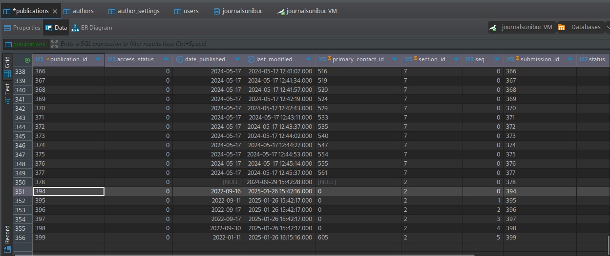

# CSV to OJS XML Import for OJS 3.5.0-3

This collection of scripts and workflows was adapted from https://github.com/rkbuoe/ojsxml repo, which, in turn is a fork of the original repo from https://github.com/ualbertalib/ojsxml.

This application will convert a CSV file into the OJS XML native import file. Following this guide you will be able to use *Native XML Plugin* to upload whole issues, if desired, or use the CLI import scripts. This application is developed and run on a Ubuntu/Mint operating system. It is not tried out on Windows OS.

The XSD of the OJS version is included with this project in the `docroot/output` directory.
Sample CSV files for both users and issues are included in the `examples` directory.

Note: This is NOT a comprehensive CSV to OJS XML conversion, and many fields are left out.

It must be mentioned, that the script needs the following packages to be installed so that SQLite3 is available, and the specific error is silenced.

```bash
sudo apt install sqlite3 php-sqlite3 
```

It would be very useful to be mentioned that a prior check with `php -m` for the `xmlwriter` would eliminate the specific error concerning the module.
If it is not installed, one should do the following on Ubuntu 24.04:

```bash
sudo apt install php8.3-mbstring php8.3-bcmath php8.3-zip php8.3-gd php8.3-curl php8.3-xml php-cli unzip -y
```

Make sure you have `pdftocairo` installed. This is part of the `poppler-utils` package. You can install it with:

```bash
sudo apt install poppler-utils
```

This is needed to extract the first page of the PDF files to use as cover images.

## Known Issues

* Each issue export XML file can contain __only one issue__. The adaptation of the scripts target 3.4. Multiple issues/XML file can lead to database corruption.
* The journal's current issue must be manually set upon import completion. This conversion tool does not indicate which issue should be the current one.
* In the case of the users, the `user_groups` section of the XML must be manually added and is journal specific. This can be found at the top of a User export XML from the current journal (see below for example).
* CSV files should be UTF8 encoded or non-ASCII characters will not appear correctly.

## How to Use

From the CLI `--help` command:

```bash
Script to convert issue or user CSV data to OJS XML.
Usage: issues|users|users:test <ojs_username> <source_directory> <destination_directory>
NB: issues source directory must include "issue_cover_images" and "article_galleys" directory
user:test appends "test" to user email addresses
```

Example:

```bash
php csvToXmlConverter issues username ./input_directory ./output_directory
```

## Preparing the issue CSV

### The field names for an issue

The CSV file should include the following headings:

`issueTitle,sectionTitle,sectionAbbrev,authors,affiliation,roarname,roarid,orcid,DOI,articleTitle,year,datePublished,volume,issue,startPage,endPage,articleAbstract,galleyLabel,authorEmail,fileName,keywords,citations,cover_image_filename,cover_image_alt_text,issue_cover_image_filename,issue_cover_image_filename_alt_text,licenseUrl,copyrightHolder,copyrightYear,locale_2,issueTitle_2,sectionTitle_2,articleTitle_2,articleAbstract_2`

### Explanation of the fields

You can have multiple authors in the "authors" field by separating them with a semi-colon. Also, use a comma to separating first and last names.

Example: `Smith, John;Johnson, Jane ...`.

The same rules for authors also apply to affiliation. Separate different affiliations with a semi-colon. If there is only 1 affiliation and multiple authors that 1 affiliation will be applied to all authors.

Citations can be separated with a new line.

The date format for the "datePublished" must be in the format `YYYY-MM-DD`. Otherwise, the date will be set automatically to 1969-12-31, which is the default date in OJS. If you do not know the date of publishing set it according to the publication apparitions during the year. For example, if the publication has only one issue in a year, and you do not know exactly when it was published, set the date to the first day of the year, e.g. `2022-01-01`. If you have multiple issues in a year, set the date to the first day of the month for the number of the issue in the year.

The following fields are optional and can be left empty:

`DOI, volume, issue, subtitle, keywords, citations, affiliation, cover image (both cover_image_filename and cover_image_alt_text must be included or omitted),licenseUrl,copyrightHolder,copyrightYear,locale_2,issueTitle_2,sectionTitle_2,articleTitle_2,articleAbstract_2`

In May, 2024 some fields were added for basic multilingual support. The extra fields are: `locale_2,issueTitle_2,sectionTitle_2,articleTitle_2,articleAbstract_2`.
The field `locale_2` should use the same format (i.e. `fr_CA`) that OJS uses for it's `locale="en"` attribute.

In March, 2025 fields `issue_cover_image_filename`, `issue_cover_image_filename_alt_text` and `orcid` were added. The first two are repeated accross all the CSV records (rows). The `orcid` must be an URL. In case of many authors, ORCIDs should be separated with `;` in the order of author completition.

In December 2025 `roarname`, and `roarid` fields were added. This was necessary to satisfy 3.5 XSD.

## Prepare article related metadata and images for the creation of the XML

The following steps are needed to prepare the article related metadata and images for the creation of the XML file. For automated processing, see below the `process-issue.sh` bash script. Before using this script, rename the `dot.env` file to `.env` from the `scripts` sub-directory, open it and modify the `BASE_PATH` value according to your environment. This path is the full path to the sub-directory where you started your work gathering the metadata (the CSV files) and the image files for the covers.

### Pure manual processing of the issue data into XML

You may choose to create the article covers by hand and copy all the resources in their indicated places. All of the following steps assume that you have the CSV file, the cover image file (jpg format) for the issue, the article PDFs, and the cover images (jpg format) for each article in a single sub-directory in a place of your preference.

1. Set up the variables in the `config.ini` file. See ***Annex 1*** for an example. This should be done only once or if you change projects.
2. Place the CSV file in the sub-directory `docroot/csv/abstracts` of the application. The `abstracts` input sub-directory must contain an `article_galleys` and `issue_cover_images` sub-directory (both of which exist within `docroot/csv/abstracts` by default), and the issue cover image if you have one. Remember to put here the issue cover image next to the CSV file.
3. Place all PDFs (galley files) in the `article_galleys` sub-directory.
4. If you have cover images for the individual articles place them in the `issue_cover_images` directory.
5. If you have the cover image for the issue, place it in the `docroot/csv/abstracts` sub-directory next to the CSV file.
6. Run `php csvToXmlConverter.php issues <ojs_username> ./docroot/csv/abstracts ./docroot/output` from the application subdirectory, where `ojs_username` should be the name of the user designated to make the uploads and management of the OJS platform. See that you already have PHP installed.
7. The XML file(s) will be output in the specified output directory (`docroot/output` directory in this case).

### Automated processing of the issue data into XML

The above steps can be tedious and error prone, especially if you have many articles in the issue. If you have all the resources in a single sub-directory, you may use the `process-issue.sh` script to automate the process of creating the XML file and copying the files to their respective places. The script could be placed in a diferent location from the ojsxml application. For convenience, it is placed in the subdirectory where all the publications resources are processed. The script should be accompanied by the `.env` file. If you don't have one, create it on the spot and addapt the `BASE_PATH` variable to your environment.

If you have created a sub-directory with all the article PDFs, the accompaning CSV file, and the issue cover image, but you have not created the article covers images (jpg format), you may use the `process-issue.sh` bash script that will do all the heavy lifting for you. Moreover, it will copy all the files to the right places, and will run the PHP command that will create the XML file in the `docroot/output` sub-directory. The script is located in the `scripts` sub-directory of the application. If you do not have a cover issue image, you may use the `extract-cover.sh` script to extract the first page of the issue PDF as a cover image.

**process-issue.sh** script will do the following:

In the begining of the script run, it will delete all the previous resources existing in the `docroot/csv/abstracts` subdirectory keeping only the necessary `.gitkeep` file. The following steps will be executed by the script:

- deletes all the files in the `docroot/csv/abstracts` sub-directory, except the `.gitkeep` file;
- copies the PDFs in the subdirectory to the `article_galleys` sub-directory;
- extracts the first page of each PDF file as a cover image (jpg format), and put it to the `issue_cover_images` sub-directory;
- copies the cover image for the issue to the `docroot/csv/abstracts` sub-directory;
- copies the CSV file containing the metadata in the `/docroot/csv/abstracts` sub-directory, and;
- copies the issue cover image to the `docroot/csv/abstracts` sub-directory;
- runs the php command that will create the XML file in the `docroot/output` sub-directory.

At the moment of the command running, the process will ask you to give it the full path (not the relative) of the sub-directory where the CSV and the PDFs and the issue cover image are located. After you input the correct path, you will be requested to enter the filename of the issue cover file. Now, all the resources will be transfered in their respective places under the `docroot/csv` sub-directory.

In the script there are some default values for the places where the CSV and the PDFs are located on the developer's machine. You may change them to your liking. If you set the `.env` file, the script will use the `BASE_PATH` variable to determine where to look for the CSV and the PDFs. If you do not set the `BASE_PATH` variable, it will use the default values from the script. For example, my `.env` file looks like this:

```bash
BASE_PATH="/home/kosson/Downloads/PLATFORMA.EDITORIALA/DATE"
USERNAME="master"
```

### User CSVs

#### Fields names for users

The CSV must be in the format of: `firstname,lastname,email,affiliation,country,username,tempPassword,role1,role2,role3,role4,reviewInterests`.

Review interests should be separated by a comma.
Example: `interest one, interest two ...`.

The following fields are optional and can be left empty: `lastname, affiliation, country, password, role1, role2, role3, role4, reviewInterests`.
If a temporary password is not supplied, a new password will be created and the user will be notified by email.

#### Prepare user related metadata for transformation in XML

1. Set up the variables in the `config.ini` file.
2. Place CSV file(s) in a single directory (optionally `docroot/csv/users`)
3. Run `php csvToXmlConverter.php users ojs_username ./docroot/csv/users ./docroot/output`
4. The XML file(s) will be output in the specified output directory (`docroot/output` directory in this case)
5. Add the `user_groups` section from a User export from the journal to the newly created XML file(s).

The `user_groups` section of the XML is specific to each journal and should therefore be taken from a sample user export from the intended journal. Any role added in the import CSV must match the `name` tag for the given user group or it will default to `Retoader`.

Current valid roles include:

- Journal manager
- Section editor
- Reviewer
- Author
- Reader

The user export XML should be in the following format:

```xml
<?xml version="1.0"?>
<PKPUsers xmlns="http://pkp.sfu.ca" xmlns:xsi="http://www.w3.org/2001/XMLSchema-instance"
          xsi:schemaLocation="http://pkp.sfu.ca pkp-users.xsd">
  <user_groups xmlns:xsi="http://www.w3.org/2001/XMLSchema-instance"
               xsi:schemaLocation="http://pkp.sfu.ca pkp-users.xsd">
    [... add journal specific user groups here]
  </user_groups>
  <users>
    [...generated by conversion tool]
  </users>
</PKPUsers>
```

At least one `user_group` must be included inside the `user_groups` tag. The `user_group` XML will look something like this:

```xml
<user_group>
  <role_id>1048576</role_id>
  <context_id>1</context_id>
  <is_default>true</is_default>
  <show_title>false</show_title>
  <permit_self_registration>true</permit_self_registration>
  <permit_metadata_edit>false</permit_metadata_edit>
  <name locale="en_US">Reader</name>
  <abbrev locale="en_US">Read</abbrev>
  <stage_assignments/>
</user_group>
```

## Hack your way through the OJS codebase to do the import

At this point you have the XML file(s) ready to be imported in OJS. The next step is to upload the XML file(s) using the *Native XML Plugin* of OJS. This plugin is available in OJS.

First, upload the users of the issue you want to upload. This part is not mandatory. The best practice would be to have all the authors as users in a curated XML file already imported. 
Make sure your OJS application uses workers. In large numbers, the uploads will be done partially. For example, from two hundred users, only a few dozens will be imported... mind this gap. For safety, use workers administrated by Supervisor (part of how OJS is set up and administered). See the official documentation. Check in the PHP configuration file `php/8.2/fpm/php.ini` for the following and increase the values for the following parameters:

```ini
post_max_size = 200M
upload_max_filesize = 200M
max_file_uploads = 100
error_log = php_errors.log
```

The increased values for RAM will avoid bamboozeled frustrated red face.
Remember to restart the PHP service after doing the modifications:

```bash
sudo systemctl restart php8.2-fpm
```

If you application is managed via Supervisor, you may restart the service with the following command:

```bash
sudo supervisorctl restart all
```

### Hacks on the OJS code needed for the import to get through

#### First, lets avoid $setsequence wrong type modifing the NativeXmlIssueFilter.php file

Unfortunatelly the application is not ready for the import of the XML file as is. It needs a bit of tinkering as following.

The lines 340 and 377 of the original file `NativeXmlIssueFilter.php` must be modified prior any attempt of upload.
Edit the file issuing the following command in the terminal of the application server:

```bash
sudo nano -l /var/www/<name.ofthe.journal.io>/plugins/importexport/native/filter/NativeXmlIssueFilter.php
```

where `<name.ofthe.journal.io>` is the name of the journal (the name of the subdirectory) you are working on.

This is necessary to avoid the following error at the moment of importing the XML file:

```txt
## Errors occured:
Generic Items
- PKP\section\PKPSection::setSequence(): Argument #1 ($sequence) must be of type float, string given, called in /var/www/revue.of.lis/plugins/importexport/native/filter/NativeXmlIssueFilter.php on line 340
```

Edit the fragment `$section->setSequence($node->getAttribute('seq'));` on the line 340, and modify it as following:

```php
$section->setSequence(floatval($node->getAttribute('seq')));
```

Function `floatval` wrapping will ensure correct casting of the value.
Edit the line 347, and modify it as following:

```php
$section->setAbstractWordCount(floatval($node->getAttribute('abstract_word_count')));
```

to avoid the following error:

```txt
APP\section\Section::setAbstractWordCount(): Argument #1 ($wordCount) must be of type int, string given, called in /var/www/<name.ofthe.journal.io>/plugins/importexport/native/filter/NativeXmlIssueFilter.php on line 347
```

Now you are ready to make the next step which involves modifications to the database, unfortunatelly. No biggie, though.

### Hack the databese on the integrity constraint violation

You are not out of the woods, yet.
Making an attempt to upload the file to import it, it will throw an error generated by the database this time. The entire error message is something along the following lines:

```txt
SQLSTATE[23000]: Integrity constraint violation: 1452 Cannot add or update a child row: a foreign key constraint fails 

(`journalsunibuc`.`publications`, 
	CONSTRAINT `publications_primary_contact_id` 
	FOREIGN KEY (`primary_contact_id`) 
	REFERENCES `authors` (`author_id`) 
	ON DELETE SET NULL
	) 
 
(SQL: update `publications` set `access_status` = 0, `date_published` = 2022-09-16, `last_modified` = 2025-01-25 19:24:02, `primary_contact_id` = 0, `section_id` = 2, `seq` = 0, `submission_id` = 380, `status` = 3, `url_path` = ?, `version` = 1, `doi_id` = ? where `publication_id` = 380)
```

This one is tricky because you have to delete the constraint between the `publications` table, and the `authors` table. It is the reason issue XML file import fails on being processed by the OJS specific part of the code.


Elimination the constraints is the first bit. Now you need to delete the foreign key connection from the `authors` table as well. If you do not operate these modifications, you cannot make the import in OJS 3.4.0.8 version, at least.
For making the modifications, [DBeaver Community](https://dbeaver.io/) was used, being configured to access the database via ssh. Do not edit the database without a backup first. The modifications were applied first on a virtualized copy of the OJS multijournal application, and then on the production machine.

Having DBeaver app started and connected to the database, proceed with the following opperations:

- delete the `publications_primary_contact_id` from `Foreign keys` belonging to the `publications` table.
- delete the `authors_publication_id_foreign` from `Foreign keys` belonging to the `authors` table. In a simple SQL script, the following commands are enough.

This is equivalent with the following SQL commands:

```sql
ALTER TABLE `authors` DROP FOREIGN KEY `authors_publications_id_foreign`;
ALTER TABLE `publications` DROP FOREIGN KEY `publications_primary_contact_id`;
```

## Now you are ready to import the XML file

Now you are ready to import the XML file. The database is ready to accept the new data.

### Upload using the CLI tools of the OJS application

First, initiate a Terminal session (any shell will do), and go to the root directory of the installed OJS application (the site sub-directory). Now, as a measure of safety, check what plugins are available running the following command:

```bash
php tools/importExport.php list
```

The result should look like the following answer:

```txt
Available plugins:
	NativeImportExportPlugin
	UserImportExportPlugin
	DOAJExportPlugin
	QuickSubmitPlugin
	PubMedExportPlugin
```

To get some documentation on the CLI tool needed (`NativeImportExportPlugin`), you may run the following command:

```bash
sudo php tools/importExport.php NativeImportExportPlugin usage
```

with the following results returned:

```log
Usage: tools/importExport.php NativeImportExportPlugin [command] ...
Commands:
	import [xmlFileName] [journal_path] [--user_name] ...
	export [xmlFileName] [journal_path] articles [articleId1] [articleId2] ...
	export [xmlFileName] [journal_path] article [articleId]
	export [xmlFileName] [journal_path] issues [issueId1] [issueId2] ...
	export [xmlFileName] [journal_path] issue [issueId]

Additional parameters are required for importing data as follows, depending
on the root node of the XML document.

If the root node is <article> or <articles>, additional parameters are required.
The following formats are accepted:

tools/importExport.php NativeImportExportPlugin import [xmlFileName] [journal_path] [--user_name]
	issue_id [issueId] section_id [sectionId]

tools/importExport.php NativeImportExportPlugin import [xmlFileName] [journal_path] [--user_name]
	issue_id [issueId] section_name [name]

tools/importExport.php NativeImportExportPlugin import [xmlFileName] [journal_path]
	issue_id [issueId] section_abbrev [abbrev]
```

If these tests returned positive results, it means you have all the tools necessary to proced to running the magic PHP command.

Now, upload and put in the root directory of the OJS application the XML file you have created with the *ojsxml* application. For the big file uploads (base64 encoding of "heavy" PDFs) do not use the GUI the OJS application is offering. It is a short path to failure. Resource to the script available in the `tools` subdirectory of the OJS application.

Let's get grinding. Position yourself in the root of the OJS application where you have also the XML file of the issue(s), and issue the following command in the terminal:

```bash
sudo php tools/importExport.php NativeImportExportPlugin import issues_0.xml ahbb --user_name master
```

where `issues_0.xml` is the file you have obtained running the *ojsxml* application, and `ahbb` being the stub by which the journal is known on the platform. The stub acts as a unique identifier for the journal.
If all goes well, the following positive response should be returned at the end of a big scroll of DB operations:

```txt
The import completed successfully. The following items were imported:

Submission
-"394" - "Sem studies regarding micromorphology of fruit"
-"395" - "First record of snowfall after over 25 years"
-"396" - "Alien flora from Neverland"
-"397" - "Contributions to the identification wild dreams"
-"398" - "Contributions to the study of alien invasive species in local pubs"
-"399" - "Analysis of some families from pilgrim's herbarium"
Issue
-"68" - "Vol. 48 No. 1 (2022): Acta Quietem Machinarium"
```

Now, what you need to do is to go to the GUI side of the OJS. Unpublish the imported issue, and for each article go to the `Contributors`, and `Set primary contact`. Choose the first author or the one you know is the primary contact. This will create the necessary links in the database. See below with only the first article set how it looks like. Observe the id numbers being filled in.



And for all the articles in the issue:

.

Observe how `primary_contact_id` column gets populated with the correspondent values.
All this implies a downtime needed of the app for safety reasons. You may try it on the fly on the production machine, but I would strongly not advice such move. Better safe than sorry.

After you finished your import(s), redo all the links you've just destroyed in the database. A simple SQL script as following.

```sql
ALTER TABLE journalsunibuc.authors ADD CONSTRAINT authors_publications_id_foreign FOREIGN KEY (publication_id) REFERENCES journalsunibuc.publications(publication_id) ON DELETE CASCADE ON UPDATE RESTRICT;
ALTER TABLE journalsunibuc.publications ADD CONSTRAINT publications_primary_contact_id FOREIGN KEY (primary_contact_id) REFERENCES journalsunibuc.authors(author_id) ON DELETE SET NULL ON UPDATE RESTRICT;
```

You could redo the connections manualy using DBeaver, but after doing this for a few rounds, it gets tedious. So, the SQL script is the way to go.

Provided all went well, you have successfuly imported a whole issue.
Congratulations!

## Annex 1

Example of working `config.ini`.

```txt
[General]
; Used to support MySQL however these database tended to be small so SQLite is all that is needed.
db_type = SQLite
sqlite_location = mysqlitedb.db
temp_table_name = ojs_import_helper

; DO NOT CHANGE
; NB: Current limitation for OJS 3.2. Maximum of one issue per file for import xml.
issues_per_file = 1

; URL where PDFs are located
; NB: Not used with OJS 3.2 conversion
pdf_url = http://127.0.0.1/

; Required fields for OJS. To be applied across all conversions
author_country = ""

;locale = "en_US"
;For OJS 3.4 you must set this to just 'en'
locale = "en"

; For use when formatting dates via DateTime::createFromFormat()
dateFormat = "Y-m-d"

; Needed for use with custom genre, e.g. "Manuscript"
genreName = ""

; Outputs info written to console to a file for reference
logLocation = "/tmp"

;Set wether we're doing a back issues import
;Applies to 3.4 only - we want everything under the default author id to avoid database integrity constraint violation
isBackIssues = False

; Default author id
; For a back issues import, choose the id of an existing author, such as an editor
defaultAuthorId = 0

; Set whether destination OJS is version 3.4
is34 = True

; To get this to work on 3.4, a couple of hacky modifications to:
; plugins/importexport/native/filter/NativeXmlIssueFilter.php
; on lines 340 and 347 are required (casts to float and int respectively)
```

## Modifications

### 19 Feb, 2025

- ojsxml code was refactored to use Composer. Now you may launch the command from anywhere you like (as part of scripts)
- `process-issue.sh` Bash script will do all the heavy lifting for you, and skip all the boring steps. See in documentation above

### 11 Mar, 2025

- ojsxml README has been completed with the necessary steps to be taken in order to import the XML file in OJS;
- fixed generating the cover of the issue. It was not available and the function `writeIssueCover` is missleading, so renamed to `writeArticleCover`. A new `writeIssueCover` function created (see IssuesXmlBuilder.php FIXME).

### 27 Mar, 2025

- added the `orcid` field to the CSV file for the issues. The field is optional, and in case of many authors, ORCIDs should be separated with `;` in the order of author completition;
- Place the cover image for the issue in the `issue_cover_images` directory. The cover image for the issue is repeated across the CSV records. The `issue_cover_image_filename` and `issue_cover_image_filename_alt_text` fields are optional. The script creates a correct `covers` element in the `<issue xmlns="http://pkp.sfu.ca" xmlns:xsi="http://www.w3.org/2001/XMLSchema-instance" published="1">` element of the output file.

### 11th of May, 2025

- clearer documentation text;
- the issue cover image is copied to the `docroot/csv/abstracts` sub-directory. This avoids confusion with the article cover images.

### 12th of May, 2025

- no more PHP warning messages when running the script;

### 18th of May, 2025

- the covers for each of the articles are created in the resulting XML file.

### 24th of May, 2025

- removing locale from `<publication xmlns:xsi="http://www.w3.org/2001/XMLSchema-instance" locale="en"`;
- fixed user appearance in the filename;
- removinf locale from `<citations locale="en">`;
- fixing native.xsd constraints;

### 25th of May, 2025

- adding clear explanations in the README.md file;
- if the cover image for issue does not exist, the `process-issue.sh` script will not try to copy it to the `docroot/csv/abstracts` sub-directory.

### 8th of December, 2025

- `roarname`, and `roarid` fields were added. This was necessary to satisfy 3.5 XSD.
